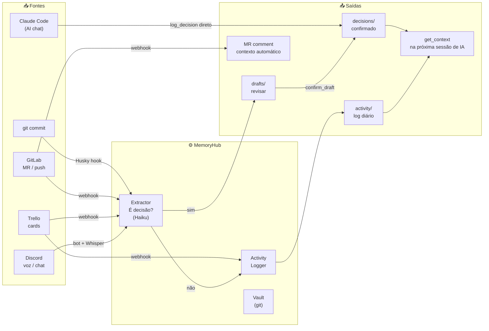

# Integrações MemoryHub

O MemoryHub captura contexto automaticamente de todas as fontes onde o time já trabalha.
Esta seção documenta cada integração — instalação, configuração e uso.

---

## Diagrama geral



---

## Índice

| Integração | O que captura | Doc |
|---|---|---|
| [git commit + Husky](./git-commits.md) | Resumo de cada commit com IA | → |
| [Claude Code (MCP)](./mcp-tools.md) | Decisões durante o chat de IA | → |
| [GitLab](./gitlab.md) | MRs, commits, comentários | → |
| [Trello](./trello.md) | Movimentação de cards, comentários, checklists | → |
| [Discord](./discord.md) | Canais de texto + gravação de voz | → |
| [Busca semântica](./semantic-search.md) | pgvector + OpenAI embeddings | → |
| [CLI e ferramentas locais](./local-tools.md) | CLI, weekly digest — sem servidor | → |

---

## Variáveis de ambiente por integração

```bash
# ── Obrigatórias ──────────────────────────────────────────────────────────────
JWT_SECRET=                    # mínimo 32 chars
DATABASE_URL=                  # postgresql://...
VAULT_DIR=/data/vault          # path local do vault

# ── GitLab ────────────────────────────────────────────────────────────────────
GITLAB_URL=https://gitlab.com
GITLAB_TOKEN=glpat-...         # read_api scope
GITLAB_WEBHOOK_SECRET=         # segredo do webhook
GITLAB_PROJECT_IDS=123,org/repo # IDs ou paths separados por vírgula

# ── Discord ───────────────────────────────────────────────────────────────────
DISCORD_BOT_TOKEN=             # portal Discord Developer
DISCORD_CHANNEL_IDS=           # IDs de canais de texto a monitorar
DISCORD_GUILD_ID=              # ID do servidor (para gravação de voz)
DISCORD_VOICE_CHANNEL_ID=      # canal de voz a gravar

# ── Trello ────────────────────────────────────────────────────────────────────
TRELLO_API_KEY=                # https://trello.com/power-ups/admin
TRELLO_TOKEN=                  # gerado na mesma página
TRELLO_BOARD_IDS=              # IDs dos boards a monitorar

# ── IA (todos opcionais — sistema funciona sem eles) ──────────────────────────
ANTHROPIC_API_KEY=sk-ant-...   # extrair decisões + resumir commits (Haiku)
OPENAI_API_KEY=sk-...          # embeddings (semantic search) + Whisper (voz)

# ── Hook de commit (no projeto alvo, não no MemoryHub) ───────────────────────
MEMORYHUB_API_URL=https://memoryhub.empresa.com
MEMORYHUB_API_TOKEN=           # JWT de /api/auth/login
MEMORYHUB_PROJECT=slug-projeto
```
