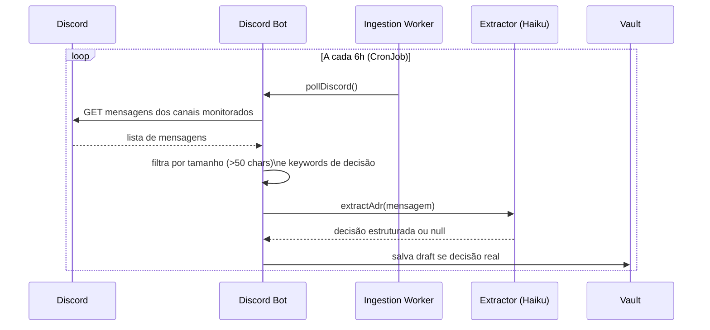
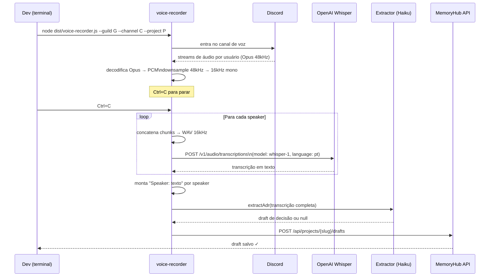

# Integração: Discord

Duas funcionalidades independentes:
1. **Monitoramento de canais de texto** — detecta decisões em mensagens
2. **Gravação de voz** — transcreve reuniões por speaker e extrai decisões

---

## Monitoramento de canais de texto



### Configuração

**1. Criar o Bot no Discord Developer Portal**

Acessar: **https://discord.com/developers/applications**

1. New Application → nome "MemoryHub"
2. Bot → Reset Token → copiar o token
3. Privileged Gateway Intents → habilitar:
   - **Message Content Intent** (obrigatório para ler mensagens)

**2. Convidar o bot para o servidor**

Na página OAuth2 → URL Generator:
- Scopes: `bot`
- Bot Permissions: `Read Messages/View Channels`, `Read Message History`

Acessar a URL gerada e adicionar ao servidor.

**3. Configurar `.env`**

```bash
DISCORD_BOT_TOKEN=MTIzNDU2Nzg5.xxxxxxx.xxxxxxxxxxxxxxxxxxxxxxxxxxxxxx
DISCORD_CHANNEL_IDS=123456789012345678,987654321098765432
```

Para obter o ID de um canal: Discord → botão direito no canal → "Copiar ID" (modo desenvolvedor ativo em Configurações → Avançado → Modo Desenvolvedor).

---

## Gravação de voz (Voice Recorder)

Transcreve reuniões no Discord por speaker usando Whisper e extrai decisões automaticamente.



### Pré-requisitos

- `OPENAI_API_KEY` — Whisper API custa **$0.006/min** (~833 min para $5)
- `DISCORD_BOT_TOKEN` com permissões de voz:
  - `Connect`, `Speak`, `Use Voice Activity`
- Escopos adicionais do bot: `voice`

**Adicionar permissões de voz ao bot** (URL Generator):
- Scopes: `bot`
- Bot Permissions: adicionar `Connect`, `Speak`, `Use Voice Activity`

### Configuração

```bash
DISCORD_BOT_TOKEN=...
DISCORD_GUILD_ID=123456789012345678    # ID do servidor Discord
DISCORD_VOICE_CHANNEL_ID=111222333444  # canal de voz a gravar
OPENAI_API_KEY=sk-...
```

### Uso

```bash
# Build necessário (TypeScript → JS)
npm run build

# Iniciar gravação
node dist/voice-recorder.js \
  --guild   $DISCORD_GUILD_ID \
  --channel $DISCORD_VOICE_CHANNEL_ID \
  --project payments-api \
  --api     https://memoryhub.empresa.com \
  --token   SEU_JWT \
  --bot-token $DISCORD_BOT_TOKEN

# O bot entra no canal e começa a gravar
# Pressione Ctrl+C para parar e processar
```

Ou via npm:

```bash
MEMORYHUB_API_URL=https://memoryhub.empresa.com \
MEMORYHUB_API_TOKEN=SEU_JWT \
MEMORYHUB_PROJECT=payments-api \
npm run voice:record
```

### O que é gerado

**Transcrição completa** (salva como draft):

```markdown
# Draft: Reunião — Rate Limiting e Circuit Breaker
**Data:** 2026-07-14
**Participantes:** Tonny Francis, Maria Silva, João Costa

---

Tonny Francis: Então, para o rate limiting, a proposta é usar Redis porque já temos na infra e
suporta operações atômicas sem race condition.

Maria Silva: Concordo. O memória local não serve em multi-instância.

João Costa: E para o circuit breaker, a gente vai com sony/gobreaker ou implementa próprio?

Tonny Francis: sony/gobreaker. Zero dependências extras, bem testada.
```

**O Extractor analisa** e gera um ADR estruturado se detectar decisões reais.

### Custo estimado

| Duração da reunião | Custo (Whisper) |
|---|---|
| 30 min | $0.18 |
| 1 hora | $0.36 |
| 2 horas | $0.72 |

### Modo offline (sem transcrição automática)

Para usar sem `OPENAI_API_KEY`, o gravador salva o áudio `.wav` localmente
e você pode transcrever depois ou usar outro serviço.

---

## Troubleshooting

**"Cannot find module 'opusscript'":** `npm install` não foi rodado. Rodar `npm install` na raiz do MemoryHub.

**Bot entra mas não grava ninguém:** verificar se `Message Content Intent` está habilitado no Developer Portal e se o bot tem permissão de ver o canal de voz.

**Transcrição em inglês:** o Whisper está configurado com `language: 'pt'` — se as reuniões forem em outro idioma, editar `src/VoiceRecorder/Transcriber.ts`:
```typescript
language: 'en'  // ou omitir para detecção automática
```

**Draft não salvo:** verificar se o projeto existe no vault (`list_decisions` no MCP) e se o JWT tem permissão de escrita.
