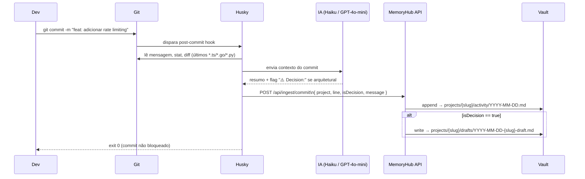

# Integração: git commit (Husky hook)

Captura um resumo de cada commit com IA e salva no activity log do projeto no vault.
Nunca bloqueia o commit — todos os erros são silenciosos.

---

## Como funciona



---

## Pré-requisitos

- Node.js 20+
- Uma chave de IA: `ANTHROPIC_API_KEY` **ou** `OPENAI_API_KEY`  
  (sem chave o hook simplesmente não faz nada — commit normal)
- MemoryHub rodando e acessível

---

## Instalação

### Opção A — `memoryhub init` (recomendado)

```bash
# Dentro do projeto a monitorar
node /caminho/para/memoryhub/scripts/memoryhub-init.mjs meu-projeto
```

Cria o hook automaticamente e gera o `.env` com os campos necessários.

### Opção B — Manual

```bash
# 1. Instalar Husky no projeto alvo
npm install --save-dev husky
npx husky init

# 2. Adicionar o hook
echo 'node /caminho/para/memoryhub/scripts/vault-commit-summary.mjs' >> .husky/post-commit
chmod +x .husky/post-commit
```

---

## Configuração

Adicionar ao `.env` do projeto alvo:

```bash
MEMORYHUB_API_URL=https://memoryhub.empresa.com   # ou http://localhost:8000
MEMORYHUB_API_TOKEN=eyJhbGciOiJIUzI1NiIs...       # JWT de /api/auth/login
MEMORYHUB_PROJECT=payments-api                      # slug do projeto no vault

# Uma das duas (ou ambas — usa Anthropic primeiro):
ANTHROPIC_API_KEY=sk-ant-...   # usa claude-haiku-4-5 (~$0.001 por commit)
OPENAI_API_KEY=sk-...          # usa gpt-4o-mini como fallback
```

### Obter o JWT

```bash
curl -s -X POST https://memoryhub.empresa.com/api/auth/login \
  -H 'Content-Type: application/json' \
  -d '{"email":"seu@email.com","password":"suasenha"}' \
  | jq -r .accessToken
```

> O token expira em 15 min por padrão. Para o hook usar um token de longa duração, crie um usuário de serviço e use o `refreshToken` (7 dias), ou aumente `JWT_EXPIRES_IN` no servidor.

---

## O que é gerado no vault

### Entry no activity log (`projects/{slug}/activity/YYYY-MM-DD.md`)

```markdown
## 14:32 — Commit [a3f9c12b](https://gitlab.com/org/repo/commit/a3f9c12b...)
**feat: adicionar rate limiting por IP** | por Tonny Francis | `payments-api`

Adicionou middleware de rate limiting usando Redis. A decisão de usar Redis em vez
de memória local foi motivada pela necessidade de funcionar em ambiente multi-instância.
```

### Draft (quando IA detecta decisão arquitetural)

```markdown
# Draft: feat: adicionar rate limiting por IP

**Source:** git commit `a3f9c12b`
**Date:** 2026-07-14

---

## 14:32 — Commit [a3f9c12b](...)
...

⚠️ Decision: Usar Redis para rate limiting em vez de memória local
para suportar deploy multi-instância.
```

---

## Como testar

```bash
# Fazer um commit qualquer
git commit -m "refactor: extrair helper de validação"

# Verificar o activity log no vault
cat vault/projects/meu-projeto/activity/$(date +%Y-%m-%d).md
```

Ou via CLI do MemoryHub:

```bash
node /caminho/para/memoryhub/scripts/memoryhub-cli.mjs activity meu-projeto --days=1
```

---

## Troubleshooting

**Hook não roda:** verificar se o arquivo `.husky/post-commit` tem permissão de execução (`chmod +x`).

**"exit 0" silencioso sem nada no vault:** verificar se as 3 vars obrigatórias estão no `.env` e se pelo menos uma chave de IA está preenchida.

**Token expirado:** gerar novo JWT com o curl acima e atualizar o `.env`.

**"Cannot find module":** o caminho para `vault-commit-summary.mjs` no hook está errado. Usar caminho absoluto.
