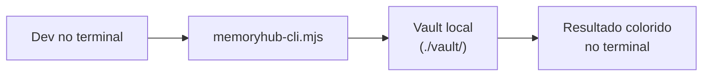

# Ferramentas locais (sem servidor)

Três ferramentas que rodam diretamente contra o vault no disco — sem servidor, sem autenticação, sem internet.
Úteis para uso offline, scripts de CI, ou devs que preferem o terminal.

---

## memoryhub-cli

CLI interativo para buscar e explorar o vault localmente.



### Instalação

```bash
# Não precisa instalar nada além do Node.js 20+
# O vault deve estar clonado localmente em ./vault/ (ou definir VAULT_DIR)

# Tornar executável (opcional)
chmod +x /caminho/para/memoryhub/scripts/memoryhub-cli.mjs
```

Criar um alias para facilitar (adicionar ao `.bashrc` / `.zshrc`):

```bash
alias mhub="node /caminho/para/memoryhub/scripts/memoryhub-cli.mjs"
```

### Configuração

```bash
# .env ou variável de ambiente
VAULT_DIR=/caminho/para/vault   # padrão: ./vault no diretório atual
```

### Comandos

#### `search` — busca full-text no vault

```bash
mhub search "gRPC"
mhub search "rate limiting" --project=payments-api
```

**Saída:**
```
projects/payments-api/decisions/2026-07-10-redis-rate-limiting.md
  L3: usar Redis para rate limiting em ambientes multi-instância
  L12: descartamos rate limiting em memória local por não funcionar

projects/payments-api/activity/2026-07-14.md
  L8: Decidimos usar Redis para rate limiting
```

---

#### `decisions` — lista decisões confirmadas

```bash
mhub decisions payments-api
mhub decisions payments-api --days=30    # últimos 30 dias
mhub decisions                           # todos os projetos
```

**Saída:**
```
payments-api
  2026-07-14  redis para rate limiting multi instancia
  2026-07-10  grpc sobre rest para comunicacao interna
  2026-06-28  pgvector para busca semantica
```

---

#### `context` — contexto de um arquivo específico

```bash
mhub context src/auth/middleware.ts
mhub context src/grpc/client.go --project=payments-api
```

Extrai keywords do caminho do arquivo e lista decisões relacionadas.

**Saída:**
```
Keywords: auth, middleware

payments-api/2026-06-28 pgvector para busca semantica
  Adotamos text-embedding-3-small para indexar decisões. Auth foi considerado...

auth-service/2026-07-01 oauth2 como provider de autenticacao
  Migramos de JWT local para OAuth 2.0 com GitLab como identity provider...
```

---

#### `activity` — log de atividades recentes

```bash
mhub activity payments-api
mhub activity payments-api --days=14
mhub activity                            # todos os projetos
```

**Saída:**
```
payments-api — last 7 days
  2026-07-14  3 event(s)
    14:32 — Commit a3f9c12b...
    09:15 — Card movido para Done
    11:30 — Comentário sobre OAuth

  2026-07-13  1 event(s)
    16:00 — MR !42 aberto
```

---

## weekly-digest

Gera um relatório markdown com o resumo da semana: decisões confirmadas, drafts pendentes e
destaques de atividade. Funciona 100% local, sem servidor.

### Uso

```bash
# Digest da última semana (stdout)
node scripts/weekly-digest.mjs

# Filtrar por projeto
node scripts/weekly-digest.mjs --project=payments-api

# Configurar período
node scripts/weekly-digest.mjs --days=14

# Salvar em arquivo
node scripts/weekly-digest.mjs --output=digest-semana-30.md

# Combinar flags
node scripts/weekly-digest.mjs --project=payments-api --days=7 --output=digest.md
```

### Exemplo de saída

```markdown
# MemoryHub Weekly Digest
**Period:** 2026-07-07 → 2026-07-14 (last 7 days)
**Generated:** 2026-07-14 23:00 UTC

## payments-api

### ✅ Decisions confirmed (2)
- `2026-07-10` **Redis para rate limiting multi-instância**
  > Usar Redis com Lua scripts para contadores atômicos. Descartamos memória local.
- `2026-07-14` **sony/gobreaker para circuit breaker gRPC**
  > Zero dependências extras, interface simples, bem testada em produção.

### ⏳ Drafts pending review (1)
- migrar autenticacao para oauth 2 0

### 📋 Activity (8 events across 4 days)
**Highlights:**
  - 09:15 — Card movido para Done: Rate limiting
  - 11:30 — Decidimos usar OAuth 2.0 com GitLab como provider

## auth-service

### ✅ Decisions confirmed (1)
- `2026-07-12` **OAuth 2.0 com GitLab como identity provider**
```

### Automatizar (cron semanal)

```bash
# crontab -e
0 9 * * 1 VAULT_DIR=/data/vault node /opt/memoryhub/scripts/weekly-digest.mjs \
  --output=/tmp/digest-$(date +\%Y-W\%V).md && \
  cat /tmp/digest-$(date +\%Y-W\%V).md | mail -s "MemoryHub Weekly" time@empresa.com
```

---

## memoryhub-init

Configura um projeto para captura automática em um comando.

### Uso

```bash
# Dentro do projeto a configurar
node /caminho/para/memoryhub/scripts/memoryhub-init.mjs nome-do-projeto
```

**O que cria:**

| Arquivo | Conteúdo |
|---|---|
| `.husky/post-commit` | Chama `vault-commit-summary.mjs` a cada commit |
| `.mcp.json` | MemoryHub como MCP server para Claude Code |
| `CLAUDE.md` | Instrui o Claude a logar decisões automaticamente |
| `.env` (stub) | 3 variáveis pré-preenchidas para preencher |
| `.gitignore` | Protege `.env` e `.mcp.json` do commit |

### Variáveis a preencher após o init

```bash
MEMORYHUB_API_URL=https://memoryhub.empresa.com
MEMORYHUB_API_TOKEN=<jwt de /api/auth/login>
# MEMORYHUB_PROJECT já vem preenchido com o slug passado no init
```

### Rodar em múltiplos projetos

```bash
for projeto in payments-api auth-service api-gateway; do
  cd /workspace/$projeto
  node /opt/memoryhub/scripts/memoryhub-init.mjs $projeto
done
```

---

## Variável de ambiente compartilhada

Todos os scripts locais respeitam:

```bash
VAULT_DIR=/caminho/para/vault
# padrão: ./vault (relativo ao diretório atual)
```

Definir globalmente no `.bashrc` / `.zshrc` se o vault estiver em um local fixo:

```bash
export VAULT_DIR=/Users/tonny/vault
```
