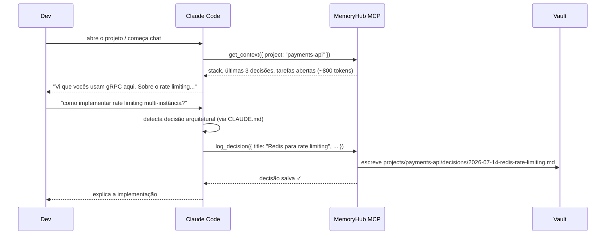

# Integração: Claude Code (MCP Tools)

O MemoryHub expõe um servidor MCP que dá ao Claude Code (e qualquer cliente MCP-compatível)
acesso direto ao vault — sem o dev precisar copiar contexto manualmente.

Com o `CLAUDE.md` certo, o Claude chama `log_decision` automaticamente durante o chat,
sem que o dev precise pedir.

---

## Como funciona



---

## Configuração global (todas as sessões)

Adicionar ao `~/.claude/settings.json`:

```json
{
  "mcpServers": {
    "memoryhub": {
      "type": "http",
      "url": "https://memoryhub.empresa.com/mcp",
      "headers": {
        "Authorization": "Bearer SEU_JWT_TOKEN"
      }
    }
  }
}
```

> Use esta opção para ter o MemoryHub disponível em todos os projetos.

---

## Configuração por projeto (recomendado)

O `memoryhub init` cria o `.mcp.json` automaticamente. Para criar manualmente:

**`.mcp.json`** na raiz do projeto:

```json
{
  "mcpServers": {
    "memoryhub": {
      "type": "http",
      "url": "https://memoryhub.empresa.com/mcp",
      "headers": {
        "Authorization": "Bearer SEU_JWT_TOKEN"
      }
    }
  }
}
```

> `.mcp.json` com token deve estar no `.gitignore` — cada dev usa seu próprio token.

---

## CLAUDE.md — auto-captura sem o dev pedir

Adicione ao `CLAUDE.md` do projeto (o `memoryhub init` faz isso automaticamente):

```markdown
## MemoryHub — captura automática de contexto

Este projeto usa MemoryHub. Siga **sempre**:

### Quando chamar log_decision
- Ao recomendar biblioteca, framework ou padrão arquitetural
- Ao decidir estrutura de feature, API ou schema
- Ao escolher entre alternativas técnicas
- Ao identificar tradeoff importante

**Formato:**
log_decision({
  title: "título curto",
  decision: "o que foi decidido",
  rationale: "por que essa escolha",
  alternatives: "o que foi descartado (opcional)"
})

### Quando chamar get_context
Sempre no início de uma sessão, e antes de sugerir algo em um arquivo:
get_context({ project: "slug-do-projeto", file: "src/path/do/arquivo.ts" })

### Regra principal
O dev não vai pedir — detecte e log automaticamente.
```

---

## Referência de tools

### `get_context`

Retorna contexto compacto do projeto (~800 tokens).

```
get_context({ project: "payments-api" })
get_context({ project: "payments-api", file: "src/auth/middleware.ts" })
get_context()   // lista todos os projetos
```

**Retorno:**
```markdown
# payments-api

**Stack:** Go, PostgreSQL, gRPC
**Owner:** backend-team
**Status:** production

## Últimas decisões
- 2026-07-10 — Usar Redis para rate limiting multi-instância
- 2026-06-28 — gRPC sobre REST para comunicação interna
- 2026-06-15 — pgvector para busca semântica de documentos

## Tarefas abertas
- Implementar circuit breaker no client gRPC
```

---

### `log_decision`

Salva uma decisão arquitetural em `decisions/`.

```
log_decision({
  project: "payments-api",
  title: "Redis para rate limiting",
  context: "O serviço roda em múltiplas instâncias e precisamos de rate limiting compartilhado.",
  decision: "Usar Redis com Lua scripts para contadores atômicos.",
  rationale: "Redis já está na infra, latência < 1ms, suporta operações atômicas nativas.",
  alternatives: "Memória local (não funciona multi-instância), DynamoDB (latência alta).",
  consequences: "Adiciona dependência do Redis; falha do Redis bloqueia requests."
})
```

Gera o arquivo `projects/payments-api/decisions/2026-07-14-redis-para-rate-limiting.md` e commita no git.

---

### `confirm_draft`

Promove um draft para decisão confirmada.

```
confirm_draft({ project: "payments-api", filename: "2026-07-14-redis-rate-limiting-draft.md" })
```

---

### `search_vault`

Busca full-text em todos os projetos ou em um específico.

```
search_vault({ query: "gRPC" })
search_vault({ query: "autenticação JWT", project: "api-gateway" })
```

---

### `semantic_search`

Busca por similaridade semântica. Requer `OPENAI_API_KEY` no servidor.

```
semantic_search({ query: "como lidamos com falhas de rede?", project: "payments-api" })
semantic_search({ query: "decisões sobre banco de dados" })
```

Sem `OPENAI_API_KEY`, cai automaticamente para busca full-text.

---

### `list_decisions`

```
list_decisions({ project: "payments-api" })
list_decisions({ project: "payments-api", includeDrafts: true })
```

---

### `read_decision`

```
read_decision({ project: "payments-api", filename: "2026-07-14-redis-rate-limiting.md" })
```

---

### `read_vault_file` / `write_vault_file`

```
read_vault_file({ path: "projects/payments-api/overview.md" })

write_vault_file({
  path: "projects/payments-api/architecture/rate-limiting.md",
  content: "# Rate Limiting\n\n...",
  commitMessage: "docs: adicionar arquitetura de rate limiting"
})
```

---

## Exemplo de sessão completa

```
Dev: Como implementar circuit breaker no client gRPC?

Claude: [chama get_context({ project: "payments-api", file: "src/grpc/client.go" })]
        Vi que usam gRPC aqui e que o Redis já está na infra.
        Para circuit breaker recomendo a lib `sony/gobreaker`...
        [decide junto com o dev]

Claude: [chama log_decision({
           project: "payments-api",
           title: "sony/gobreaker para circuit breaker gRPC",
           decision: "Usar sony/gobreaker com threshold de 5 falhas em 30s",
           rationale: "Lib simples, zero dependências, bem mantida",
           alternatives: "hystrix-go (mais pesado), implementação própria"
         })]
        Decisão salva no vault. Agora vou mostrar o código...
```

O próximo dev que abrir Claude Code nesse projeto já verá essa decisão em `get_context`.

---

## Troubleshooting

**Tool não aparece no Claude Code:** verificar se `.mcp.json` está na raiz do projeto e se o servidor está rodando (`curl https://memoryhub.empresa.com/healthz`).

**"Unauthorized":** token JWT expirado. Gerar novo com `/api/auth/login`.

**`log_decision` não salva:** verificar se o `project` passado existe no vault (`list_decisions` para ver projetos).

**Claude não chama os tools automaticamente:** verificar se o `CLAUDE.md` tem a seção MemoryHub. O `memoryhub init` adiciona automaticamente.
