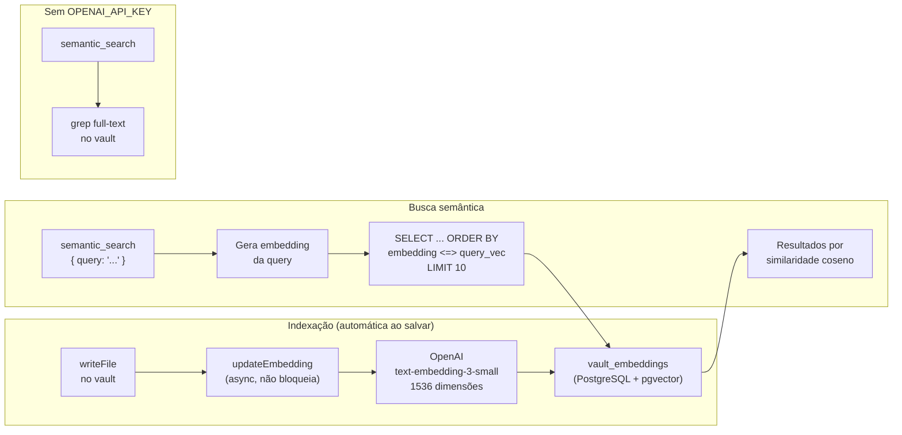

# Integração: Busca Semântica (pgvector + OpenAI)

Encontra decisões e documentos por significado, não por palavra exata.
Pergunta "como lidamos com falhas de rede?" e encontra documentos sobre retry, circuit breaker,
timeout — mesmo sem usar essas palavras na busca.

**Completamente opcional** — sem `OPENAI_API_KEY` o sistema usa busca full-text normalmente.

---

## Como funciona



---

## Pré-requisitos

- PostgreSQL com extensão `pgvector` (já incluída na imagem Docker do MemoryHub)
- `OPENAI_API_KEY` com acesso ao modelo `text-embedding-3-small`

**Custo:** $0.02 por 1 milhão de tokens. Um documento típico de decisão (~500 tokens) custa **$0.00001** para indexar. Praticamente zero.

---

## Configuração

### 1. Garantir que pgvector está instalado

```bash
# Verificar (via docker ou psql direto)
psql $DATABASE_URL -c "SELECT extversion FROM pg_extension WHERE extname = 'vector';"
# Deve retornar uma versão (ex: 0.8.0)

# Se não retornar nada:
psql $DATABASE_URL -c "CREATE EXTENSION IF NOT EXISTS vector;"
```

> O `docker-compose.yml` e o Helm chart já criam a extensão automaticamente via `docker/init.sql`.

### 2. Adicionar OPENAI_API_KEY

```bash
# .env do servidor MemoryHub
OPENAI_API_KEY=sk-...
```

Reiniciar o servidor:

```bash
# Docker Compose
docker compose restart memoryhub

# Kubernetes
kubectl rollout restart deployment/memoryhub
```

### 3. Indexar documentos existentes

Novos documentos são indexados automaticamente quando salvos. Para indexar o vault existente:

```bash
# Via API (requer ADMIN)
curl -X POST https://memoryhub.empresa.com/api/ingest/run \
  -H "Authorization: Bearer TOKEN"
```

Ou criar os embeddings um a um re-salvando via MCP:

```
write_vault_file({ path: "projects/api/decisions/2026-07-14-redis.md", content: conteudo })
```

---

## Uso

### Via MCP (Claude Code)

```
semantic_search({ query: "como lidamos com falhas de rede?" })
semantic_search({ query: "decisões sobre banco de dados", project: "payments-api" })
```

### Via Web UI

```
GET /api/search?q=como+lidamos+com+falhas&mode=semantic&project=payments-api
```

### Via CLI local (sem servidor, usa grep como fallback)

```bash
node scripts/memoryhub-cli.mjs search "falhas de rede"
```

---

## Modelos disponíveis

| Modelo | Dimensões | Custo/1M tokens | Qualidade |
|---|---|---|---|
| `text-embedding-3-small` | 1536 | $0.02 | boa (padrão usado) |
| `text-embedding-3-large` | 3072 | $0.13 | melhor, 6x mais caro |
| `text-embedding-ada-002` | 1536 | $0.10 | legado, não recomendado |

Para trocar o modelo, editar `src/Service/Embedding.Service.ts`:

```typescript
model: 'text-embedding-3-large',  // se quiser maior precisão
```

---

## Diferença entre busca full-text e semântica

| Busca | Query | Encontra |
|---|---|---|
| Full-text | "Redis" | Só docs com a palavra "Redis" |
| Semântica | "Redis" | "Redis", "cache em memória distribuída", "Valkey", "armazenamento chave-valor" |
| Full-text | "falhas de rede" | Só docs com exatamente essa frase |
| Semântica | "falhas de rede" | "retry policy", "circuit breaker", "timeout", "resiliência" |

---

## Troubleshooting

**"Unsupported vector(1536)":** o pgvector não está instalado no banco. Verificar seção "Garantir que pgvector está instalado" acima.

**Resultados irrelevantes:** normal com poucos documentos (< 20). A busca semântica melhora com mais conteúdo indexado.

**Embedding não atualiza ao salvar:** verificar nos logs do servidor se `updateEmbedding` está sendo chamado. Se `OPENAI_API_KEY` não estiver definida, o embedding é silenciosamente pulado.

**Rate limit OpenAI:** em bulk indexing, o adapter respeita os rate limits. Para indexação de vault grande (100+ docs), o processo pode levar alguns minutos.
