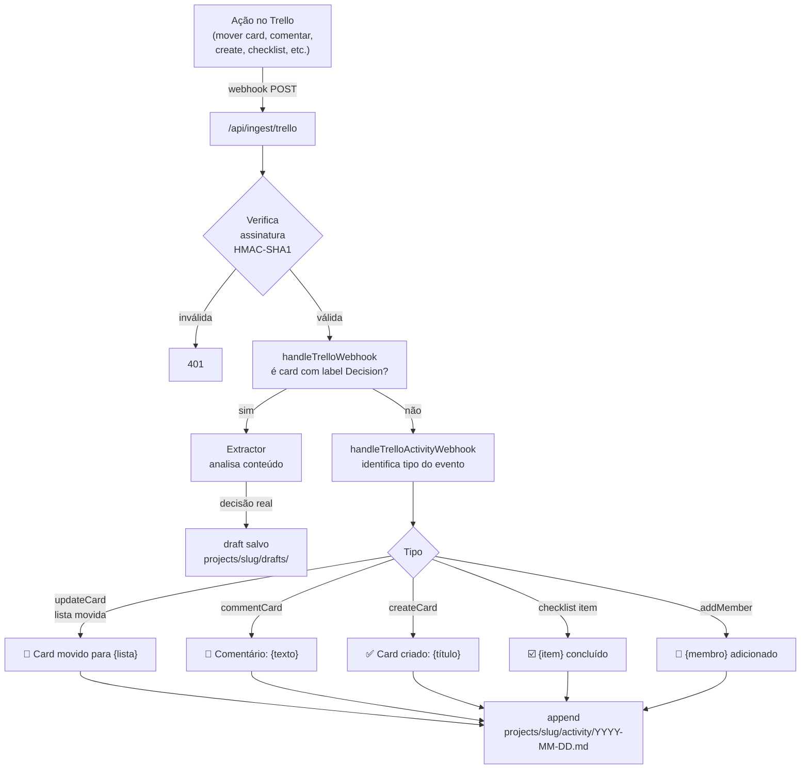

# Integração: Trello

Captura movimentações de cards, comentários, checklists e criações em tempo real via webhook.
Tudo vai para o activity log diário do projeto. Cards com label "Decision" geram um draft.

---

## Como funciona



---

## Pré-requisitos

- Conta Trello (gratuita funciona)
- API Key e Token do Trello
- URL pública do MemoryHub

---

## Configuração

### 1. Obter API Key e Token

Acessar: **https://trello.com/power-ups/admin**

1. Criar um "Power-Up" (pode ser nome fictício)
2. Ir em API Key → copiar a key
3. Clicar em "Token" para gerar o token OAuth

```bash
TRELLO_API_KEY=xxxxxxxxxxxxxxxxxxxxxxxxxxxxxxxx
TRELLO_TOKEN=xxxxxxxxxxxxxxxxxxxxxxxxxxxxxxxxxxxxxxxxxxxxxxxxxxxxxxxxxxxxxxxx
TRELLO_BOARD_IDS=AbCdEfGh,IjKlMnOp    # IDs dos boards (ver abaixo como obter)
```

### 2. Obter os IDs dos boards

```bash
curl "https://api.trello.com/1/members/me/boards?key=$TRELLO_API_KEY&token=$TRELLO_TOKEN&fields=id,name" \
  | jq '.[] | "\(.name) — \(.id)"'
```

### 3. Registrar webhook

O Trello valida a URL antes de registrar — o MemoryHub responde `200` no `HEAD /api/ingest/trello` automaticamente.

```bash
# Um webhook por board:
curl -X POST "https://api.trello.com/1/webhooks" \
  -H "Content-Type: application/json" \
  -d '{
    "key": "'"$TRELLO_API_KEY"'",
    "token": "'"$TRELLO_TOKEN"'",
    "callbackURL": "https://memoryhub.empresa.com/api/ingest/trello",
    "idModel": "AbCdEfGh",
    "description": "MemoryHub — payments-api"
  }'
```

Repetir para cada board. Verificar os webhooks registrados:

```bash
curl "https://api.trello.com/1/tokens/$TRELLO_TOKEN/webhooks?key=$TRELLO_API_KEY&token=$TRELLO_TOKEN"
```

### 4. Mapear boards para projetos

Por padrão, o adapter usa o nome do board como slug do projeto (lowercase, hifenizado).
Para mapear explicitamente, editar `src/Ingestion/Adapters/Trello.Adapter.ts`:

```typescript
const BOARD_PROJECT_MAP: Record<string, string> = {
  'AbCdEfGh': 'payments-api',
  'IjKlMnOp': 'auth-service',
};
```

---

## Eventos capturados

| Evento Trello | O que salva | Exemplo |
|---|---|---|
| `updateCard` (muda lista) | Card movido de → para | `🚀 Card movido: "Rate limiting" → Done` |
| `commentCard` | Texto do comentário | `💬 Tonny Francis: "Decidimos usar Redis"` |
| `createCard` | Criação do card | `✅ Card criado: "Implementar circuit breaker"` |
| `updateChecklistItemStateOnCard` | Item de checklist marcado | `☑️ "Testes de carga" concluído` |
| `addMemberToCard` | Membro adicionado ao card | `👤 Maria Silva adicionada a "Rate limiting"` |

---

## Cards como decisões

Cards com a label **"Decision"** ou **"ADR"** (case-insensitive) são enviados para o Extractor
e geram um draft se confirmados como decisão real.

**Criar a label no board:**
1. Abrir qualquer card → Labels → Create a new label
2. Nome: `Decision`, cor: verde
3. A partir daí, qualquer card com essa label aciona o fluxo de decisão

---

## O que é salvo no vault

### Activity log diário (`projects/{slug}/activity/2026-07-14.md`)

```markdown
# Activity Log — 2026-07-14

## 09:15 — Card movido: [Implementar rate limiting](https://trello.com/c/abc123)
**De:** In Progress → **Para:** Done | por Tonny Francis | `payments-api`

## 11:30 — Comentário em [Arquitetura de auth](https://trello.com/c/def456)
**Tonny Francis:** Decidimos usar OAuth 2.0 com GitLab como provider. Auth0 foi descartado por custo.

## 14:00 — Card criado: [Circuit breaker no client gRPC](https://trello.com/c/ghi789)
por Maria Silva | `payments-api`

## 16:45 — ☑️ "Testes de carga" concluído
Card: [Rate limiting](https://trello.com/c/abc123) | por Tonny Francis
```

---

## Troubleshooting

**Webhook não é registrado ("URL não acessível"):** o Trello faz um HEAD request para validar. Verificar se `HEAD /api/ingest/trello` retorna 200:
```bash
curl -I https://memoryhub.empresa.com/api/ingest/trello
```

**"401 Invalid signature":** o HMAC é calculado com `TRELLO_TOKEN`. Verificar se o token no `.env` é o mesmo usado para registrar o webhook.

**Board não mapeado para projeto correto:** adicionar o mapeamento explícito em `BOARD_PROJECT_MAP` no adapter.

**Remover um webhook:**
```bash
curl -X DELETE "https://api.trello.com/1/webhooks/WEBHOOK_ID?key=$TRELLO_API_KEY&token=$TRELLO_TOKEN"
```
